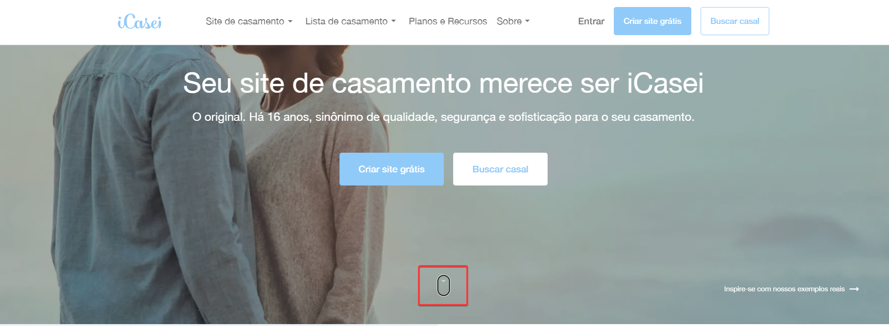
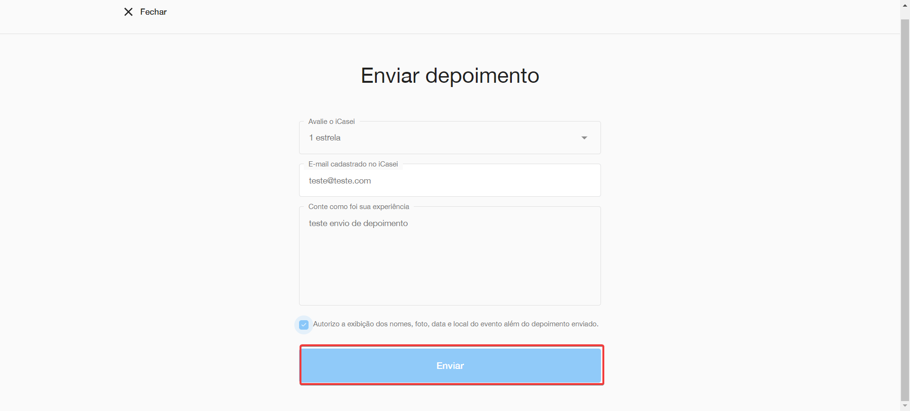
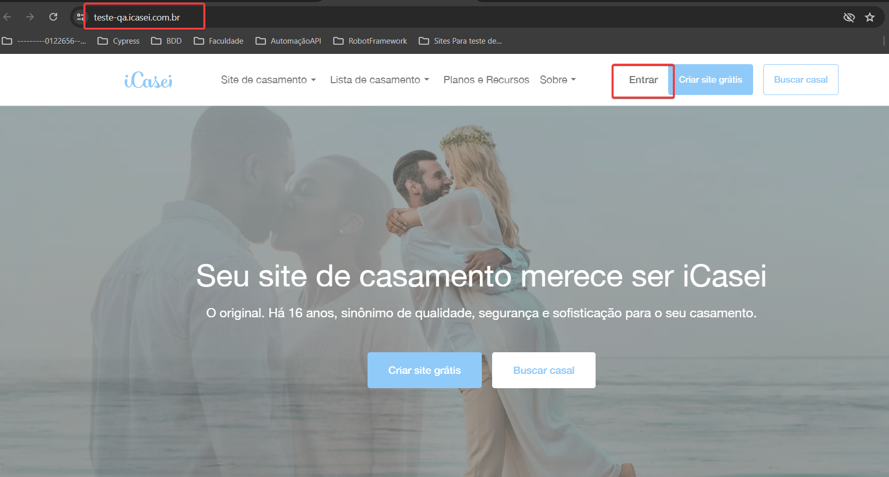
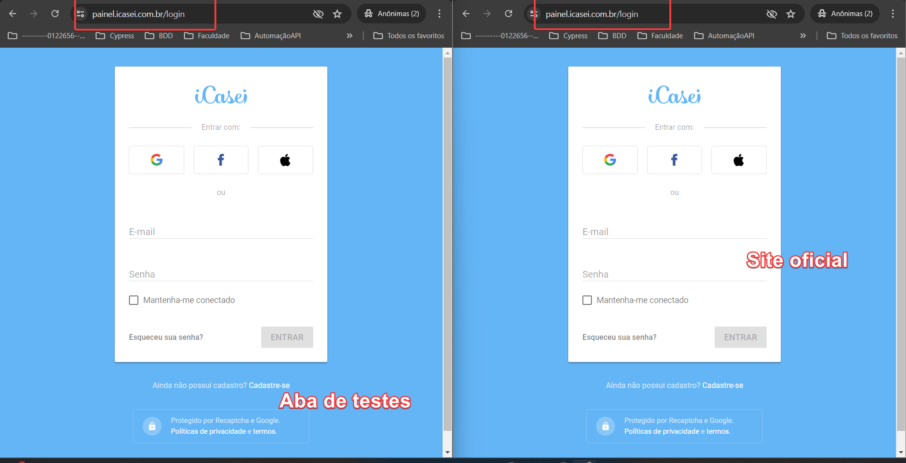
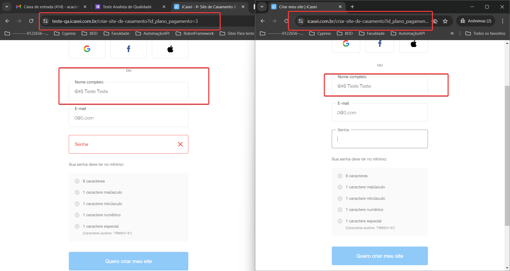
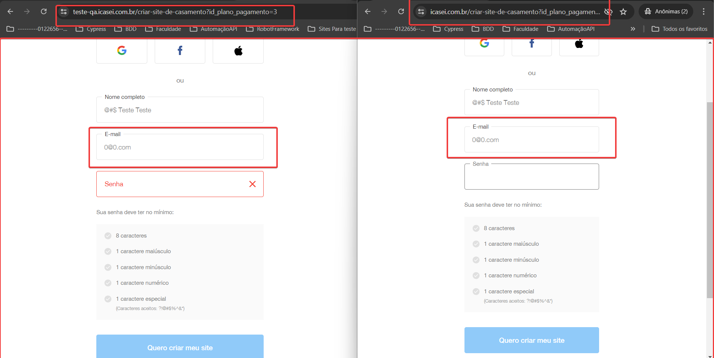
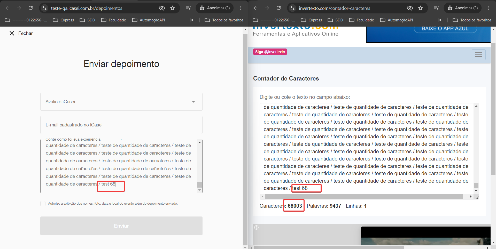

# Desafio Icasei
## Sites para realização dos testes 
- https://www.icasei.com.br/ 
- https://teste-qa.icasei.com.br/

## 1 - Botão 'Ir para a proxima seção' não responde ao click

Passos para reproduzir o erro:
1. O usuário deve está na tela inicial do site
2. Deve clicar na opção de 'ir para a próxima seção'
3. Ao realizar o click o sistema deve redirecionar o usuário para a proxima seção

Resultado Atual:
  - Atualmente quando o usuário clica no botão de ir para a proxima seção o sistema não redireciona para a seção esperada.

Resultado Esperado:
  - É esperado que quando o usuário realizar o clique no botão o sistema redirecione para a proxima seção.

## 2 - Depoimento não é enviado ao clicar no botão de 'Enviar'

Passos para reproduzir o erro:
Tela Site de Casamentos:
1. O usuário deve está na tela inicial do site
2. Clicar no menu 'Lista de casamento' 
3. Acessar a seção de Depoimentos
4. Clicar em ver mais depoimentos
5. Clicar em Enviar depoimento

Tela Lista de Casamentos:
1. O usuário deve está na tela inicial do site
2. Clicar no menu 'Site de casamento' 
3. Acessar a seção de Depoimentos
4. Clicar em ver mais depoimentos
5. Clicar em Enviar depoimento

Resultado Atual:
  - Atualmente quando o usuário tenta enviar um depoimento em uma dessas telas ao clicar em 'Enviar' o sistema não envia o depoimento.

Resultado Esperado:
  - É esperado que ao clicar no botão 'Enviar' o depoimento seja enviado.

## 3 - Usuário é redirecionado para o site oficial ao clicar em 'Entrar'

Passos para reproduzir o erro:
1. O usuário deve está na tela inicial do site
2. Clicar em 'Entrar'

Cenário em BDD:
 - Dados  que o usuário está no site de teste
 - Quando efetuar o clique na opção de 'Entrar'
 - Então ele deverá ser redirecionado para a tela de login do site de testes

Resultado Atual:
  - Atualmente quando o usuário está no site de testes e clica na opção de 'Entrar' o sistema redireciona ele para o site oficial
   

Resultado Esperado:
  - É esperado que se o usuário está no site de testes e clicar no botão 'Entrar' ele continue no site de testes e não no oficial.

## 4 - Sistema permite cadastrar data de casamento invalida

Passos para reproduzir o erro:
1. O usuário deve está na tela inicial do site
2. Clicar em 'Criar site gratis'
3. Preencher os campos 'nome, email e senha'
4. Validar o checkbox
5. Finalizar a compra do carinho
6. Preencher o nome e o email
7. clicar em 'Continuar'
8. Na aba 'Cadastre o seu amor'

Cenário em BDD:
 - Dados que o usuário realizou o cadastro no site
 - Quando finalizar a compra do carrinho
 - E preencher o campo 'Nome e email'
 - Então quando ele preencher o campo de data do casamento, o sistema deve exibir uma mensagem de erro

Resultado Atual:
  - Atualmente quando o usuário está na aba 'Cadastre o seu amor' ao preencher o campo de data com uma data invalido o sistema não emite nenhuma mensagem de erro

Resultado Esperado:
  - É esperado que ao preencher o campo com uma data invalido, o sistema emite uma mensagem de erro solicitando a correção da data

  OBS: Esse erro é apresentado em produção também.

## 5 - Sistema permite preencher o campo 'Nome' com caracteres especiais

Passos para reproduzir o erro:
1. O usuário deve está na tela inicial do site
2. Clicar em 'Criar site gratis'
3. Preencher o campo 'Nome completo' com caracteres especiais

Cenário em BDD:
 - Dados que o usuário realizou o cadastro no site
 - Quando clicar em 'Criar site gratis'
 - E preencher o campo com caracteres especiais
 - Então o sistema não deve permitir cadastrar o nome com caracteres especiais

Resultado Atual:
  - Atualmente quando o usuário está na aba 'Criar site gratis' ao preencher o campo 'Nome' com caracteres especiais sequenciais o sitema não emite nenhuma mensagem de erro

Resultado Esperado:
  - É esperado que ao preencher o campo 'Nome' com caracteres especiais sequenciais o sitema deve emite alguma mensagem de erro

  OBS: Esse erro é apresentado em produção também.

## 6 - Sistema permite preencher o campo 'Email' com dados invalidos

Passos para reproduzir o erro:
1. O usuário deve está na tela inicial do site
2. Clicar em 'Criar site gratis'
3. Preencher o campo 'Email' com dados invalidos
 - EX: 0@0.com

Cenário em BDD:
 - Dados que o usuário realizou o cadastro no site
 - Quando clicar em 'Criar site gratis'
 - E preencher o campo com dados invalidos
 - Então o sistema deve emitir uma mensagem de erro solicitando a correção da escrita

Resultado Atual:
  - Atualmente quando o usuário está na aba 'Criar site gratis' ao preencher o campo 'Email' com dados invalidos o sitema não emite nenhuma mensagem de erro

Resultado Esperado:
  - É esperado que ao preencher o campo 'Email' com dados invalidos o sitema deve emite alguma mensagem de erro

  OBS: Esse erro é apresentado em produção também.

  ### Dica de melhorias: 
   - Adicionar um limitador no campo de texto de depoimentos, a principio o site principal está aceitando + '56592'
   