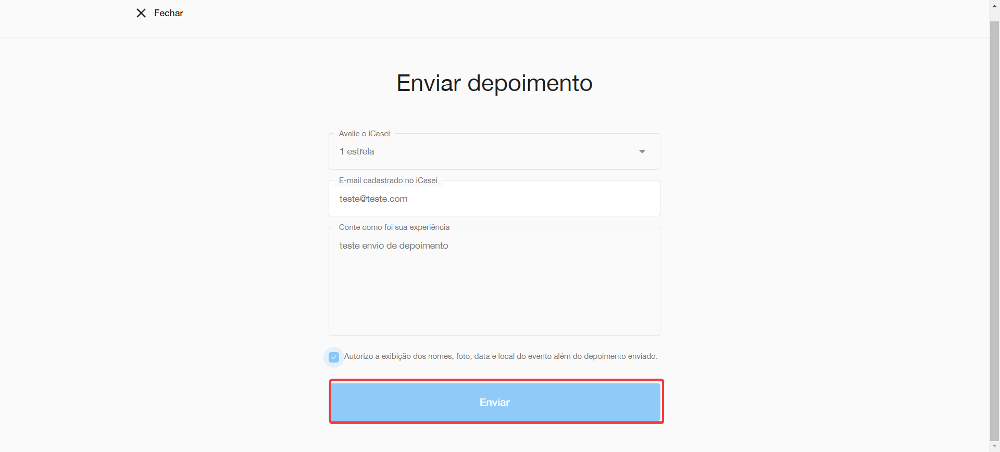

### História de Usuário: Bug na Tela de 'Enviar Depoimento'

#### Descrição do Bug

Um usuário relatou que ao tentar enviar um depoimento na tela de 'Enviar depoimento', o depoimento não é enviado quando clica no botão 'Enviar'.

#### Cenário de Teste

**Dado que** estou na tela de 'Enviar depoimento'

**Quando** seleciono o campo 'Avalie o ICasei'

**E** preencho o email cadastrado no ICasei

**E** preencho o campo de texto

**Então** ao selecionar o check e clicar no botão 'Enviar', o sistema não está enviando o depoimento

#### Passos para Reproduzir

##### Caminho 1:
1. Clicar no menu 'Site de casamento'
2. Navegar até 'Depoimentos'
3. Clicar em 'Ver mais depoimentos'
4. Clicar em 'Enviar depoimento'

##### Caminho 2:
1. Clicar no menu 'Lista de casamento'
2. Navegar até 'Depoimentos'
3. Clicar em 'Ver mais depoimentos'
4. Clicar em 'Enviar depoimento'

#### Comportamento Esperado

- O sistema deve enviar o depoimento após o usuário preencher todos os campos obrigatórios, selecionar o check e clicar no botão 'Enviar'.

#### Comportamento Atual

- O depoimento não é enviado após clicar no botão 'Enviar', apesar de todos os campos obrigatórios estarem preenchidos e o check selecionado.

#### Detalhes Técnicos

- **Página/Tela**: Enviar depoimento
- **Componente**: Botão 'Enviar'
- **Erro**: O botão 'Enviar' não está funcional e não processa o envio do depoimento

#### Impacto

- Usuários não conseguem enviar depoimentos, o que pode afetar a funcionalidade do site e a satisfação do usuário.

#### Evidência

#### Ação Recomendada

- [ ] Reproduzir o bug em um ambiente de desenvolvimento.
- [ ] Corrigir o bug e realizar testes de validação.
- [ ] Implementar a correção em ambiente de produção.
- [ ] Comunicar o usuário sobre a resolução do bug.
